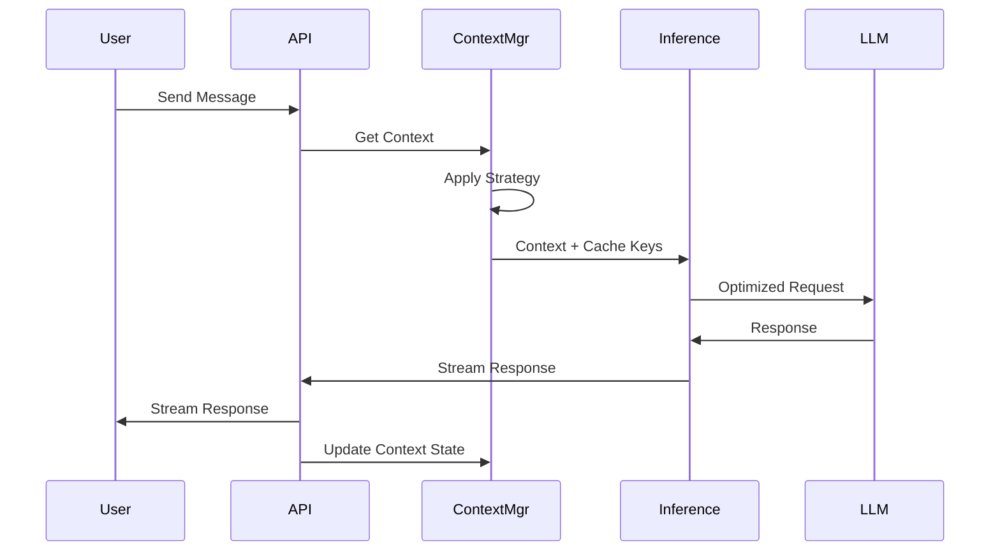

# Arc Architecture Design

## Overview

Arc uses a microservices architecture with three main components:
1. **Backend API** - Handles authentication, conversation management, and WebSocket connections
2. **Context Management Service** - Manages conversation context, caching, and state
3. **Inference Service** - Routes requests to LLM providers and handles prompt caching

## Service Responsibilities

### Backend API (Current)
- User authentication
- Conversation CRUD operations
- WebSocket management for real-time chat
- Message storage and retrieval
- Participant management

### Context Management Service (New)
- **Context Strategies**:
  - Rolling Context: Rotates out old messages every N messages
  - Static Context: Fixed context that doesn't change
  - Memory Compression: Summarizes older messages (future)
  - RAG Context: Manages retrieval-augmented generation (future)
- **State Management**:
  - Maintains context state across requests
  - Tracks prompt cache keys
  - Manages context windows
- **Optimization**:
  - Determines optimal rotation points for cost efficiency
  - Balances cache hits vs context relevance

### Inference Service (Enhanced)
- **Request Routing**: Routes to appropriate LLM provider
- **Prompt Cache Management**: 
  - Tracks Anthropic cache points
  - Optimizes for cache hits
  - Coordinates with Context Manager
- **Provider Integration**: Handles provider-specific formatting

## Context Management Strategies

### 1. Rolling Context
```typescript
interface RollingContextConfig {
  maxMessages: number;        // Total messages to keep
  rotationInterval: number;   // Rotate every N messages (e.g., 20)
  cacheBreakpoint: number;    // Where to split for caching
  preserveSystemPrompt: boolean;
}
```

**Implementation**:
- Maintains a sliding window of messages
- Rotates out oldest `rotationInterval` messages when limit reached
- Keeps early messages stable for cache hits
- Example: With 100 max messages and rotation of 20:
  - Messages 1-80 stay cached
  - Messages 81-100 are the active rolling window
  - When message 101 arrives, messages 81-100 become 61-80, and 81-101 is the new window

### 2. Static Context
```typescript
interface StaticContextConfig {
  systemPrompt: string;
  staticMessages: Message[];  // Never change
  appendOnly: boolean;        // Can only add, not remove
}
```

**Implementation**:
- Entire context is cacheable
- New messages append to the end
- Ideal for consistent personas or fixed scenarios

### 3. Memory Compression (Future)
```typescript
interface MemoryCompressionConfig {
  compressionThreshold: number;  // Messages before compression
  compressionRatio: number;      // Target reduction ratio
  preserveKeyPoints: boolean;    // Keep important moments
}
```

### 4. RAG Context (Future)
```typescript
interface RAGContextConfig {
  retrievalTrigger: 'always' | 'onDemand' | 'periodic';
  maxRetrievedChunks: number;
  cacheRetrievals: boolean;
  retrievalPosition: 'start' | 'beforeUser' | 'dynamic';
}
```

## Communication Flow



## Implementation Phases

### Phase 1: Context Management Service (Week 1)
- [ ] Extract context building logic from inference service
- [ ] Implement rolling context strategy
- [ ] Implement static context strategy
- [ ] Add context state persistence
- [ ] Create gRPC/REST API for communication

### Phase 2: Enhanced Prompt Caching (Week 1-2)
- [ ] Track Anthropic cache points
- [ ] Optimize message ordering for cache hits
- [ ] Add cache analytics and monitoring
- [ ] Implement cache key management

### Phase 3: Service Integration (Week 2)
- [ ] Update WebSocket handler to use Context Service
- [ ] Add service health checks
- [ ] Implement circuit breakers
- [ ] Add comprehensive logging

### Phase 4: Advanced Features (Future)
- [ ] Memory compression strategies
- [ ] RAG integration points
- [ ] Multi-turn planning
- [ ] Context branching for parallel conversations

## Deployment Considerations

### Development
- All services run locally
- Docker Compose for easy setup
- Shared volumes for state during development

### Production
- Kubernetes deployment recommended
- Redis for distributed state
- Service mesh for inter-service communication
- Horizontal scaling for each service

## State Management

### Context State Schema
```typescript
interface ContextState {
  conversationId: string;
  strategy: ContextStrategy;
  currentWindow: Message[];
  cachedPrefix: Message[];
  cacheKey?: string;
  metadata: {
    totalMessages: number;
    lastRotation: Date;
    cacheHits: number;
    estimatedCost: number;
  };
}
```

### Persistence Options
1. **Redis**: For production distributed state
2. **PostgreSQL**: For audit trail and analytics
3. **In-Memory**: For development and small deployments

## API Design

### Context Management Service API
```typescript
// Get optimized context for a conversation
POST /context/prepare
{
  conversationId: string;
  strategy: ContextStrategy;
  newMessage?: Message;
  options?: ContextOptions;
}

// Update context state after inference
POST /context/update
{
  conversationId: string;
  responseMessage: Message;
  cacheHit: boolean;
  tokenUsage: TokenUsage;
}

// Get context analytics
GET /context/analytics/:conversationId
```

## Monitoring and Observability

### Key Metrics
- Cache hit rate by strategy
- Context preparation latency
- Token usage by conversation
- Cost savings from caching
- Strategy effectiveness

### Logging
- Structured logging with correlation IDs
- Context decision audit trail
- Cache key tracking
- Performance profiling

## Security Considerations

- Service-to-service authentication (mTLS in production)
- Rate limiting per user/conversation
- Context size limits
- Encryption for sensitive context state

## Migration Path

1. **Current State**: Monolithic backend with integrated inference
2. **Step 1**: Extract interfaces and add abstraction layer
3. **Step 2**: Implement Context Service alongside existing code
4. **Step 3**: Gradually migrate conversations to use Context Service
5. **Step 4**: Move inference logic to dedicated service
6. **Step 5**: Deprecate old code paths

This architecture provides the flexibility and scalability needed for Arc's advanced context management requirements while maintaining system reliability and performance.

